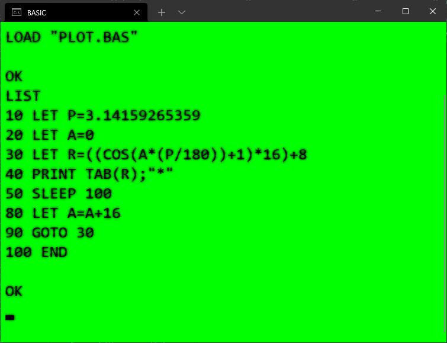

# ecma_basic
A .Net implementation of the ECMA-55 and ECMA-116 BASIC standards.

The purpose of this project is to provide a simple 80's style BASIC environment for learning how to program.

Fire up ecmabasic55.exe to get a standard-looking BASIC prompt, then start firing off those line numbers!  You can also provide a .BAS file as a parameter to ecmabasic55.exe to run it in batch mode.  Type in a program, then use the SAVE command to save it to a file.  LOAD will bring a program back into memory.  RUN will... run the program...

There is a wiki with more project details [here](https://github.com/treytomes/ecma_basic/wiki/).
