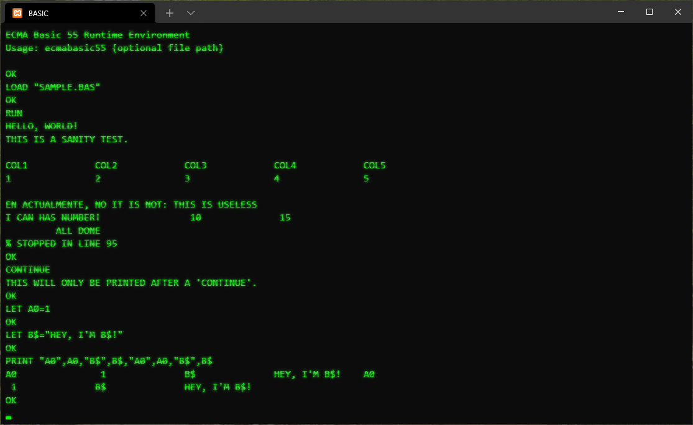

# ecma_basic
A .Net implementation of the ECMA-55 and ECMA-116 BASIC standards.

There is a wiki with more project details [here](https://github.com/treytomes/ecma_basic/wiki/).

# Sub Projects

## ECMABasic55

The environment for playing with ECMA BASIC-55.

Usage: ecmabasic55 <filename.bas>

## ECMABasic116

The environment for playing with ECMA BASIC-116.

## ECMABasic.Core

Contains the tokenizer / interpreter bits.

## ECMABasic.Test

Unit tests to verify the interpreters against the ECMA-55 and ECMA-116 standards.

The BASIC-55, Sample test category tests the interpreter against the NBS test programs.

# References

* [ECMA Standards](https://www.ecma-international.org/publications-and-standards/standards/)
* [NBS Minimal BASIC Test Programs v1 vol1, Test System Overview](https://nvlpubs.nist.gov/nistpubs/Legacy/IR/nbsir78-1420-1.pdf)
* [NBS Minimal BASIC Test Programs v1 vol2, General Program Structure, Output, Assignment, Simple Control Structures, Simple Expressions](https://www.govinfo.gov/content/pkg/GOVPUB-C13-d18a3ec7d1e82bd2a5ed110c7d52b3b0/pdf/GOVPUB-C13-d18a3ec7d1e82bd2a5ed110c7d52b3b0.pdf)
* [NBS Minimal BASIC Test Programs v1 vol3, Control Statements, Data Structure, Program Input](https://www.govinfo.gov/content/pkg/GOVPUB-C13-362a101fac7df281372bcfc48b171007/pdf/GOVPUB-C13-362a101fac7df281372bcfc48b171007.pdf)
* [NBS Minimal BASIC Test Programs v2 vol1, Documentation](https://nvlpubs.nist.gov/nistpubs/Legacy/SP/nbsspecialpublication500-70v1.pdf)
* [NBS Minimal BASIC Test Programs v2 vol2, Source Listings and Sample Output](https://www.govinfo.gov/content/pkg/GOVPUB-C13-80893981584ab9bc20fb7cf7814c635a/pdf/GOVPUB-C13-80893981584ab9bc20fb7cf7814c635a.pdf)
* [John's ECMA-55 Minimal BASIC Compiler](https://buraphakit.sourceforge.io/BASIC.shtml)
* [ECMA-55 Minimal BASIC System - bas55](https://jorgicor.niobe.org/bas55/)
