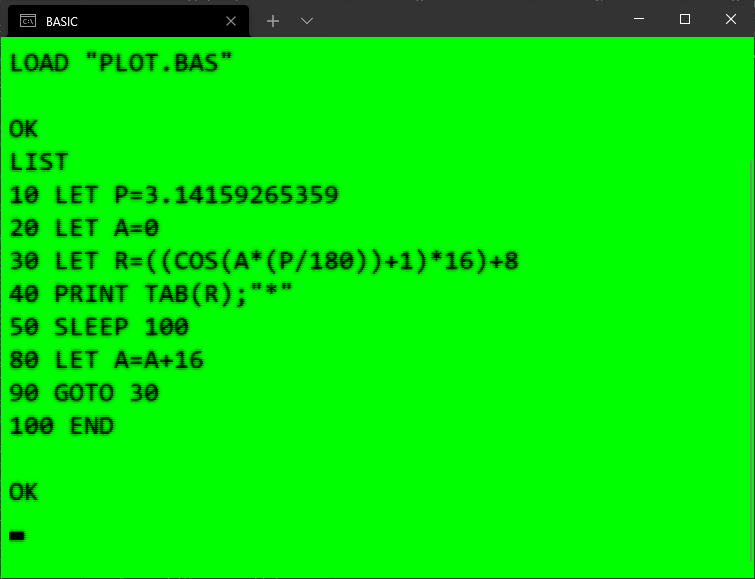

# ECMA BASIC

A .NET 10 implementation of the ECMA-55 (Minimal BASIC) and ECMA-116 BASIC standards.



The purpose of this project is to provide a simple 80's style BASIC environment for learning how to program.

## Quick Start

```bash
# Build the project
./build.sh      # or build.bat on Windows

# Run the REPL
./run.sh        # or run.bat on Windows

# Run a BASIC program
./run.sh path/to/program.BAS

# Run tests with coverage
./test.sh       # or test.bat on Windows
```

## Features

- **ECMA-55 Compliant**: Implements the Minimal BASIC standard
- **Interactive REPL**: Classic command-line interface with immediate-mode commands
- **Batch Mode**: Run .BAS files directly from the command line
- **Educational**: Designed for learning programming fundamentals

### Immediate Mode Commands

- `RUN` - Execute the program in memory
- `LIST` - Display the current program
- `NEW` - Clear the program from memory
- `LOAD "filename"` - Load a program from disk
- `SAVE "filename"` - Save the current program to disk
- `CONTINUE` - Resume after STOP statement

### Supported BASIC Statements

LET, PRINT, INPUT, GOTO, GOSUB, RETURN, IF-THEN, FOR-NEXT, READ-DATA, REM, STOP, END

## Documentation

- **[Wiki](https://github.com/treytomes/ecma_basic/wiki/)** - Project documentation and guides
- **[Issues](https://github.com/treytomes/ecma_basic/issues)** - Specifications and bug reports
- **[CLAUDE.md](CLAUDE.md)** - Development guidelines for AI assistants

## Development

This project follows:
- **Clean Architecture** principles
- **Spec-Driven Development** (tests before implementation)
- **80% minimum code coverage** requirement

See [CLAUDE.md](CLAUDE.md) for detailed development guidelines.
